# 1. Algoritma ve Veri Yapıları
Bu repository içerisinde Algoritma ve Veri Yapıları için aldığım notlar, uygulamalarım ve örnekler yer alıyor

## 1.1 Veri Yapıları (Data Structures)
Veri yapısı,veriye erişim verinin depolanmasını ve verinin organizasyonunu temsil eder.

Bir veri yapısı, veri değerleri, veriler arasındaki ilişkiler ve verilere uygulanabilecek işlevler veya işlemlerin bir koleksiyonudur.

Genellikle verimli veri yapıları,verimli algoritmaları oluşturmanın yoludur.


- linear
    - array
        - single dimension array
        - multi dimension array
    - list
        - array list
        - generic list
        - sorted list
        - linked list
    - stack
    - queue
- non-linear
    - graf
        - tree
            - binary tree
                - binary search tree
                    - self balancing tree
                        - AVL tree
                        - Red-black tree
            - heap
                - binary heap
                - binominal heap
                - fibonacci heap
## 1.2 Veri Tipleri

- data types
    - value types
        - struct
        - enum
    - reference types
        - class
        - interface
        - delegate

<code>value_type: struct_type | enum_type;</code><br>
<code>enum_type: type_name ;</code><br>
<code>struct_type: type_name | simple_type | nullable_type;</code><br>
<code>simple_type: numeric_type | 'bool';</code><br>
<code>numeric_type: integral_type | floating_point_type | 'decimal';</code><br>
<code>nullable_type: non_nullable_value_type '?';</code><br>
<code>non_nullable_value_type: type;</code><br>
<code>enum_type:type_name;</code><br>
<code>floating_point_type: 'float' | 'double';</code><br>
<code>integral_type: 'sbyte' | 'byte' | 'short' | 'ushort' | 'int' | 'uint' | 'long' | 'ulong' | 'char';</code><br>


### Yerleşik Veri Türleri

- built-in data type (value)
    - short
    - int 
    - double
    - char
    - decimal
- built-in data type (reference)
    - object
    - string
    - dynamic

### Kullanıcı Tanımlı Veri Türleri

- Custom/user defined data type(value)
    - struct
- Custom/user defined data type (reference)
    - class

#### Struct
- Farklı veri türlerini tek bir yapı altında toplamaya ihtiyaç duyulduğunda struct kullanılabilir.
- Temel amaç verinin bütününü temsil edecek alt veri türlerini bir yapı altında toplamaktır.
- Verinin organize edilmesi için kullanılan en eski programlama bileşenlerinden biridir.
- Küçük ölçekli verileri organize etmek gerektiğinde class yapılarının yerine struct yapısı kullanılabilir.
- Struct tanımlaması class tanımlama yapısına benzemektedir. 
- Struct yapısı değer(value) tiplidir;sınıflar gibi referans tipli değildir
- Struct kullanımı tamamlandıktan sonra bellekten hızlıca kaldırılabilir.
- Bu yapıların bellekten kaldırılmasını beklemek üzere Garbage Collection'ın beklenmesine gerek yoktur.
- Sınıf yapısına kıyasla performansı daha iyidir.
- Kalıtımı desteklemezler
- Struct yapısının da System.ValueType'dan türetilir.
- Struct yapısı kalıtımın uygulanmasını desteklemek ancak interface inheritance destekler.
- Struct yapısı bir metoda parametre olarak uygulanacak ise dikkat edilmelidir
- Struct yapısı her zaman stack (yığında) tutulmaz.Bazı durumlarda heap bölgesinde de tutulabilirler.
- C# 7.2 ile birlikte construct referans türler heap bölümünde ve value türleri tipik olarak stack bölümünde tutulurlar.
- Value tipleri sadece stack bölümünde tutulurlar.

#### Class
- Nesne yönelimli programlamanın temel öğesidir.
- İçerisinde field,property,method,operatör gibi pek çok farklı üye barındırır.
- Referans tipli bir veri türüdür.
- Sınıf ve arayüz kalıtımını destekler

## 1.3 Veri Organizasyonu
- Değişken
    - Hafızada bir yer ayırmak gerekli durumlarda ayrılan yere değer atamak değeri değiştirmek ve okumak için kullaılan programlama bileşeni değişken olarak adlandırılır.
    - Bir başka ifadeyle değişken, bir değeri tutan depolama konumudur.
    - Değişken, üç temel boyutu ile düşünülmelidir.
    - Sabitler program boyunca değeri değişmeyen özel bir değişken türü olarak düşünülebilir.

**x in alabileceği değerler**
| -128 |. . .|X|. . .| 127 |
|---|---|---|---|---|

**1 byte = 8 bit** <br>
**sbyte tipinde tanımlanan bir x değikeni olsun.**
<code>sbyte x = 127; </code>

|0|1|1|1|1|1|1|1|
|---|---|---|---|---|---|---|---|
|signed/unsigned bit 2<sup>7</sup> |2<sup>6</sup>|2<sup>5</sup>|2<sup>4</sup>|2<sup>3</sup>|2<sup>2</sup>|2<sup>1</sup>|2<sup>0</sup>|

burada eğer 1 ise o bit altındaki değer alınır değilse alınmaz
<code>0</sup>+2<sup>6</sup>+2<sup>5</sup>+2<sup>4</sup>+2<sup>3</sup>+2<sup>2</sup>+2<sup>1</sup>+2<sup>0</sup>=255</code> <br>
eğer en soldaki bit 0 ise sayı pozitif 1 ise negatif anlamına gelir hesaplamaya dahil edilmez işaret bitidir.işaretli veri tipleri sbyte,double,int gibi veri tipleri negatif yada pozitif değerler tutabilen veri tipleridir.

istisna bir durumda eğer işaret biti 1 olsaydı aşağıdaki gibi ... <br>
|1|0|0|0|0|0|0|0|
|---|---|---|---|---|---|---|---|
|signed bit 2<sup>7</sup>|2<sup>6</sup>|2<sup>5</sup>|2<sup>4</sup>|2<sup>3</sup>|2<sup>2</sup>|2<sup>1</sup>|2<sup>0</sup>|

<code>2<sup>7</sup>+0+0+0+0+0+0+0=-128</code>

eğer **X** değişkeni <code>byte</code> olarak tanımlanmış olsaydı 0 ile 255 arasında değer alabilirdi yani işaretsiz bir veri türü olduğu için bellekteki organizasyonuda farklılık gösterecektir.255 değerini elde etmek için sadece tüm bitler 1 olacaktır.

|1|1|1|1|1|1|1|1|
|---|---|---|---|---|---|---|---|
|signed bit 2<sup>7</sup>|2<sup>6</sup>|2<sup>5</sup>|2<sup>4</sup>|2<sup>3</sup>|2<sup>2</sup>|2<sup>1</sup>|2<sup>0</sup>|

<code>2<sup>7</sup>+</sup>+2<sup>6</sup>+2<sup>5</sup>+2<sup>4</sup>+2<sup>3</sup>+2<sup>2</sup>+2<sup>1</sup>+2<sup>0</sup>=255</code> <br>


## 1.4 Soyut Veri Türü(Abstract Date Type)
- Yığın Ana İşlevler(last in first out)
    - yığınlar bağlı listeler veya diziler ile tasarlanabilir.
    - Push (T item) : yığına ekleme işlemi
    - Pop () : yığından eleman çıkartma
    - Peek () : yığından bir eleman çıkartılacaksa hangi elemean olduğu bilgisini verir ama yığından elemean çıkartmaz
- Kuyruk Ana İşlevler(first in first out)
    - dizi,dinamik dizi,bağlı liste,sabit boyutlu,çevrimsel dizi ile tasarlanabilir. 
    - EnQueue (T item) : kuytuğun sonuna eleman ekler
    - DeQueue () : liste başından elemean çıkartır.
    - Peek () : kuyruktan bir eleman çıkartılacaksa hangi elemean olduğu bilgisini verir ama yığından elemean çıkartmaz

## Algoritma Analizi ve Asimtotik Notasyonlar
Karmaşık matematiksel hespların belirli bir düzenek tarafından yapılmasını sağlayan turing makinesinin özel bir durmunu ifade eden hesaplamalı bir modeldir.
- girişi olmalıdır.
- çıkışı olmalıdır.
- her adımı tanımlı olmalıdır.
- sınırlı sayıda adımda olamalıdır.
- etkililik (zamansal/uzaysal analiz)

### Zaman Karmaşıklığı (Time Complexity)
- Algoritma girdisi
    - Dizi (boyutu)
    - Polinom (polinom derecesi)
    - Matris (eleman sayısı)
    - İkilik veri (bit sayısı)
    - Graf (kenar ve düğüm sayısı)
- Algoritmanın dayandığı paradigma
    - Backtracking, Branch and bound, Brute-force search,Divide and conquer,Dynamic programing,Greedy algorithm,Prune and seach

<code>T(n)</code>
T : çalışma süresi
(n) : Süre zamanı değil, işlem sayısını ifade eder.

**Bağımlılıklar**
- Çalışma süresi
- işlem sayısı
- sabit işlem süresi
- Giriş boyutunun büyümesi
- Asimptotik notasyonlar
    - Time complexity (n)
    - Space cost (n)
    - Space complexity(n)

### Bir algoritmanın yürütme zamanı analizi(runnning time analysis)
1. SELECT THE FISRT UNSORTED ELEMENT
2. SWAP OTHER ELEMENTS TO THE RIGHT TO CREATE THE CORRECT POSITION AND SHIFT THE UNSORTED ELEMENT
3. ADVANCE THE MARKER TO THE RIGHT ONE ELEMENT
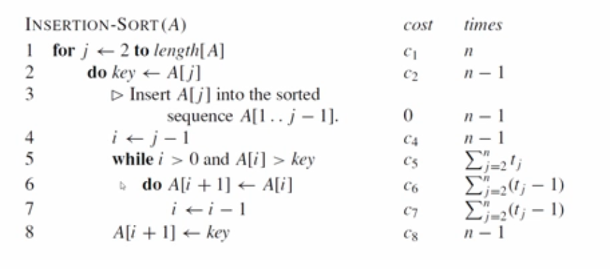
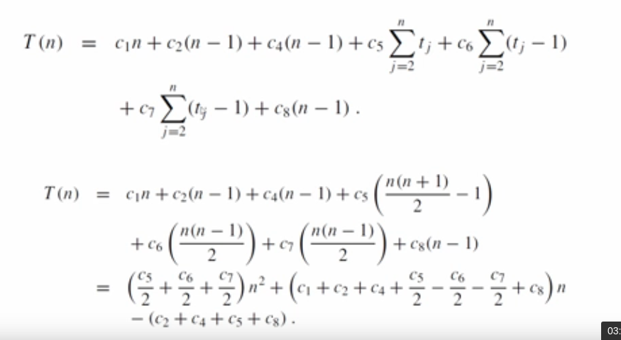

#### Bir döngünün çalışma zamanı analizi
**örnek 1**

*DÖNGÜ;*
```c#
i = 1 ;                     // c1
sum = 0 ;                   // c2
while ( i <= n ){           // c3
    i = i + 1 ;             // c4
    sum = sum + i ;         // c5
}
```
|maliyet|defa|
|--|--|
|c1|1|
|c2|1|
|c3|n+1|
|c4|n|
|c5|n|

*Toplam maliyet:*<code> c1 + c2 + c3*(n+1) + c4*n +c5*n</code>

**örnek 2**
```c#
double OrtalamaHesapla(double[] A)
{
    double ortalama = 0; toplam = 0; // değişken tanımlamaları için 2 işlem
    for (int i = 0; i > A.length; i++) // döngü başlatmak için 1 işlem
    // A'nın uzunluğunu kontrol eden 1 işlem ve her tekrardar i' yi arttıran 1 işlem ile toplam 2 işlem
    {
        toplam += A[i]; // ! içerisindeki değeri toplam içine atan 1 işlem ve bu A' nın length değeri kadar tekrar edeceğinden A'nın uzunluğu kadar çarpılır A.length = n olursa n*1 ve döngü devam ederken A'uzunluğu kadar devam eden arttırma ve kontrolleri dahil edersek toplam döngü için n*3 = 3n kadar işlem 
    }
    ortalama = toplam / A.Length; // 1 işlem 
    return ortalama; // 1 işlem 
}
```
<code>T(n)= 2 + 1 + (n * (1 + 1 + 1)) + 1 + 1 T(n) = 3 + 3n + 2 T(n) = 5 + 3n</code><br>
*Asimptotik Notasyon Gösterimi*
<code>T(n)=O(n)</code>
bu kod lineer Complexity bir yapıdadır.

**örnek 3**
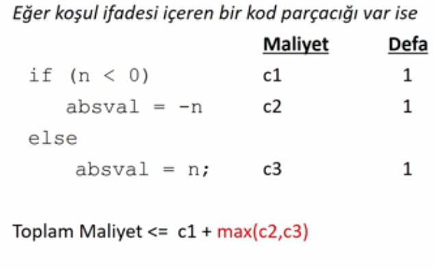
```c#
void KosulBloklari(int n)
{
    int toplam = 0; // 1
    if (n % 2 == 0) // 1
        for ( int i = 1; i <= n; i++) // 2n +2 
            toplam += i * i; // n*1
        //min(3n+2) 
    else
        for (int i = 0; i <n; i++) // n*2 +2
            for (int j=0;j<n;j++) //(n*2 +1)n
                toplam +=i; //n*1*n
        // maks((2n+2) + (2n+2)*n + n*2)
    Console.WriteLine(toplam);
}
```
#### İç içe döngünün çalışma zamanı analizi
**içiçe döngüler**
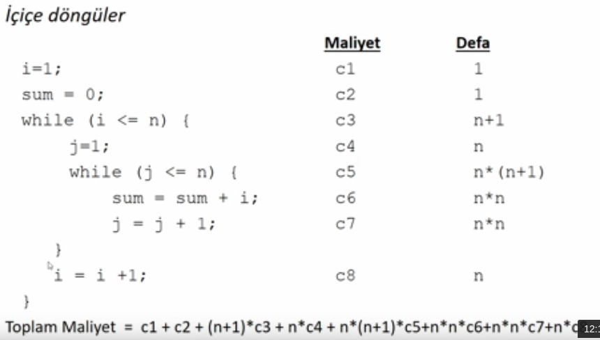
Bu algoritmanın çalışma zamanı n<sup>2</sup> ile orantılıdır.

```c#
int MatrisElemanlarininToplami(int[,] A )
{
    int toplam= 0 ; // 1
    int n = A.GetLength(0); // 1
    int m = A.GetLength(1); // 1
    for (int i = 0; i < n;i++) // 2n + 2
    {
        for (int j = 0;j <m;j++) // 2m + 2
        {
            toplam += A[i,j]; // m
        }
    }
    return toplam; // 1
}
```
<code>T(n,m)=3 + (2n + 2) + n*(2m + 2) + n*m + 1</code>

## Big-Oh
- Sıralama
    - Insertion
    - Selection
    - Quicksort
    - Binary
    - Bubble

<code>|f(n)|<= c *|g(n)|,tüm n >= n<sub>0</sub></code>

Pozitif tam sayılardan pozitif tam sayılara kadar `f(n)` ve `g(n)` monotonik(sürekii artan) fonksiyonlar için c > 0 ve n<sup>0</sup> sabitleri olduğunda `f(n)= O(g(n))` şeklinde ifade edilir.

Sezgisel olarak bu `f(n)` fonksiyonunun g(n)'den daha hızlı büyümediği veya `g(n)` fonksiyonunun `f(n)` için yeterince büyük olan `n->∞` için bir üst sınıf olduğu anlamına gelir.

`f(n) = O(g(n))`

- Çalışma zamanı giriş botuyunun boyutuna bağlı olarak artar.
- Giriş boyutu n'e bağlı olarak varsayım yapılmamalıdır.
- n her zaman küçük olmayabilir.
- Büyüme hızı (Rate of Growth):Girdinin bir fonksiyonu olarak çalışma süresinin artma hızı
- Alt sıradan terimler (Lower Order Term):Bir fonksiyonun büyüme oranına ilişkin bir tahmin verildiğinde daha yüksek dereceli şartlar için daha az önemli olduklarından, düşük dereceden terimleri düşürme eğilimindeyiz.<br>
<code>f(n) = n<sup>3</sup>+ 5n + 3</code><br>
<code>O(<sup>3</sup>)</code><br>
Bir yürütme zamanı analizinda herzaman en yüksek değer dikkate alınmalıdır.örnek olarak f(n) fonksiyonunda 5n + 3 kısmını dikkate almamalıyız. Burada Sabit faktörler ve düşük dereceli terimler gibi ikinci dereceden ayrıntıları gizlemek ve girdi boyutu büyüdükçe bir algoritmanın çalışma süresinin nasıl ölçeklendiğine odaklanmak istiyoruz.Küsüratlarla ilgilenmiyoruz.Baskın olan terim dikkate alınmalıdır.

1. Giriş botutuna bağlı karmaşıklık
2. Makineden bağımsız
3. Temel Bilgisayar adımları

**Ölçüm Türleri**
1. En kötü durum (worst-case)
2. En iyi durum (base-case)
3. Ortalama durum (average-case)

**Genel Kurallar**
1. Sabitler ihmal edilir.(Constant factor)
    - `T(n)= 5n + 3 => O(n)`
    - `T(n)= 10n + 99 => O(n)`
    - `T(n)= 1000n => O(n)`
2. Baskın terim dikkate alınır.
    - `O(1)<O(logn)< O(n)` : O(logn)-> logaritmik, O(1)->sabit zamanlı, O(n)->lineer zamanlı bir ifadedir.
    - <code>O(n<sup>2</sup>+5n+100) => O(n<sup>2</sup>)</code>
    
**Örnek**
|Fonksiyon|Big O|
|--|--|
| <code>n<sup>4</sup>+100n<sup>2</sup>+10n+50</code> | <code>O(n<sup>4</sup>)</code>|
|<code>10n<sup>3</sup>2n<sup>2</sup></code>|<code>O(n<sup>3</sup>)</code>|
|<code>n<sup>3</sup>-n<sup>2</sup></code>|<code>O(n<sup>3</sup>)</code>|
|<code>10</code>|<code>O(1)</code>|
|<code>1273</code>|<code>O(1)</code>|

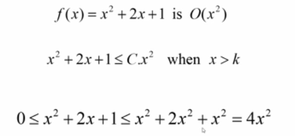
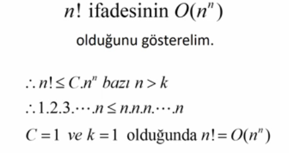

## o-Notasyonu
sınırlama durum
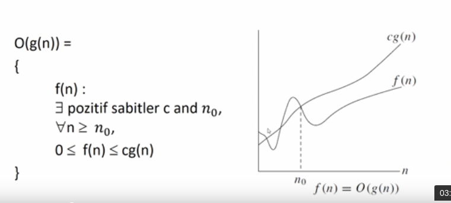

## teta-Notasyonu
ortalama durum
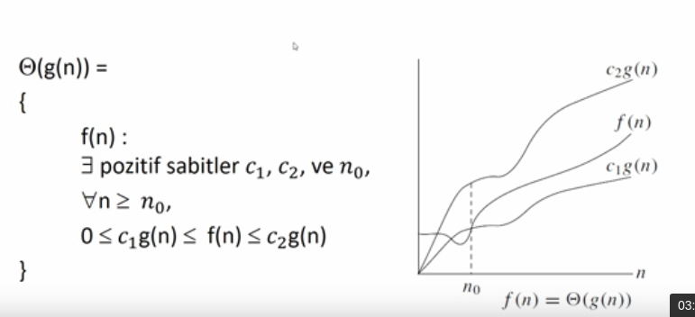

## omega-notasyonu
alt sınır durumu
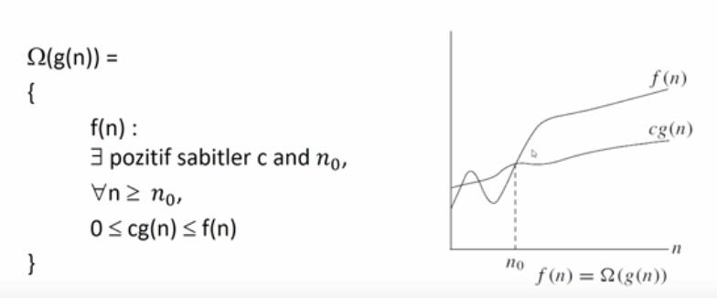

## Şematik gösterim
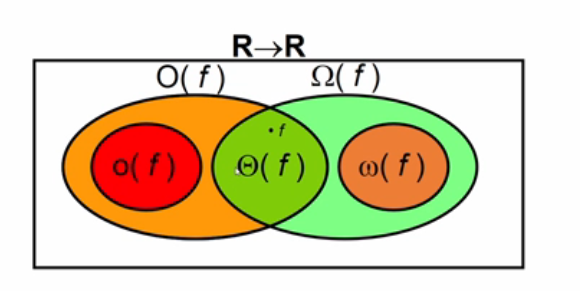

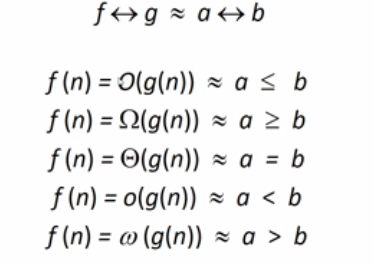

**monotonluk**
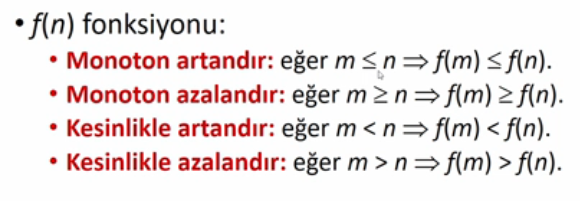

## Asymtotic Analysis
```python
# loops
n = 10 # 1
for i in range(0,n): # n
    print('Current number: '+ str(i)) # 1

    # n + 1 -> O(cn) = O(n)
```
<code>Total<sub>time</sub>= a constant c * n = c*n = O(n)</code>

```python
# nested loops
# outloop executed n times
n = 10
for i in range(0,n):
    print('Current number: ' +str(i))
    for j in range(0,n):
        print('Current number:' + srt(i)+ ',' + str(j))
```
<code>Total<sub>time</sub>= c * n * n = O(n<sup>2</sup>)</code>

## Recursive(Özyinelemeli) ifadeler
- Kendini çağıran herhangi bir fonksiyon **recursive** olarak adlandırılır.
- Özyinelemeli bir yöntem,daha küçük bir sorun üzerine çalışmak için kendisinin bir kopyasını çağırarak bir sorunu çözer.Bu **recursion step** olarak adlandırılır.
- Recursive adım çok daha fazla recursive çağrı ile sonuçlanır.

**Recursive**

- Durma koşulu olmalıdır.
- Küçük problemlerin daha küçük dizileri temel duruma **(base case)** yakınsamalıdır.
- Çoğu zaman iteratif kod yazmaktan daha kısa ve kolaydır.
- Benzer alt görevlerin kullnımında daha kullanışlı olurlar.Sıralama, arama ve gezinme problemleri bu duruma örnek olarak gösterilebilir. 
- 
    ```
    if (test for the base case)
        return some base case value
    else if (test for another base case)
        return some another base case value
    else
        return (some work and then a recursive call)
    ``` 

|recursive|iteratif|
|--|--|
|Temel durum (base case) ulaşınca durur|bir koşulun yanlış olması durumunda durur.|
|Her recursive çağrı ekstra bellek alanı kullanılır|Her bir iterasyon ekstra bellek alanı gerektirmez|
|Eğer sonsuz recursive çağrı yapılırsa bellek taşma hatası alınır stack overflow|Ekstra bellek alanı gerektirmediğinden sonsuz döngüler sonsuza kadar devam eder|
|Bazı problemlerin çözümü recursive olarak daha kolay ifade edilebilir|İteratif çözümler recursive çözümler kadar açık olmayabilir.|

- **Recursive için Notlar**<br>
    - Recursive algoritmalar iki durum içermelidir.
        - Recursive durumlar ve temel durum(birden fazla olabilir.)
    - Her recursive fonksiyon durumu temel durumda durmalıdır.
    - Genellikle iteratif çözümler recursive çözümlerden daha verimlidir.
        - Çünkü ekstra bellek alanı kullanmazlar.
    - Bazı problemler en iyi recursive çözümler ile çözülebilirken bazıları için durum tam tersidir.

- **Özyinelemeli Çağrılar**
    - Fibonacci series
    - Factorial finding
    - Merge sort,quick sort
    - Binary search 
    - Tree traversals and many tree problems: InOrder,PreOrder,PostOrder
    - Graph Traversals:DFS,BFS
    - Dynamic Programming Examples
    - Divide and Conquer Algorithms
    - Towers of Hanoi
    - Backtracking Algorithms

## Dizi
- En temel veri yapılarından biridir.
- Dizi elemanlarına erişmek üzere genellikle sıfır-tabanlı indisleme(zero-base indexing) kullanılır.
- Tek boyutlu (single-dimension) yada çok boyutlu (multi-dimension) olabilir.
- Düzenli (regular) yada düzensiz (jagged) olarak tanımlanabilir.
- En büyük dezavantajı sabit boyutlu olmasıdır.
- Dizinin sabit boyutlu olmasından dolayı ekleme ve silme gibi işlemlerin maliyeti artar.
- En büyük avantajı ise bellek gözlerine doğrudan erişimin olmasıdır.

## Koleksiyonlar (Collections)
Bir grup nesnenin organize şekilde yönetildiği yapılar Collections olarak ifade edilebilir.Bu yapılarda ilgili veri yapısına ekleme yapma araya ekleme yapma arama,sıralama yada özel birtakım fonksiyonlar içerir.Collections ifadeleri generic yada non-generic olarak tanımlanabilirler.
Array, en çok sabit sayıda güçlü biçimde yazılmış nesneler oluşturmak ve bunlarla çalışmak için kullanışlıdır.

Collections nesne gruplarıyla çalışmak için daha esnek bir yol sağlar.Dizilerden farklı olarak,birlikte çalıştığınız nesne grubu uygulamanın ihtiyaçları değiştikçe dinamik olarak büyüyebilir ve küçülebilir.(growing and shringking)

Bazı koleksiyonlarda, koleksiyona eklediğiniz herhangi bir nesneye bir anahtar atayabilirsiniz böylece anahtarı kullanarak nesneyi hızlı bir şekilde alabilirsiniz.
`<TKey,TValue>`

**System.Collections**
- *ArrayList*, *Hashtable*, *Queue*, *Stack*,

**System.Collections.Generic**
- *Dictionary< TKey,TValue >*, *List< T >*, *Queue< T >*, *SortedList< TKey,TValue >*, *Stack< T >*, *SortedSet < TKey,TValue >*, *HashSet < TKey,TValue >*

**System.Collections.Concurrent**

**System.Collections.Specialized**

**System.Collections.Immutable**

- Koleksiyonu numaralandırma yeteneği 
    - **System.Collections.IEnumerable**(Objeye bağlı) veya **System.Collections.Generic.IEnumerable< T >**(Generic yapı var ise)

- Bir Enumerator, koleksiyondaki herhangi bir öğeye taşınabilir bir işaretçi olarak düşünülebilir.

- Bir **foreach** döngüsü **GetEnummerator** metodu kullanarak taşınabilir işaretçi yardımıyla koleksiyondaki öğeler üzerine dolaşabilir.

- **System.Collections.Generic.IEnumerable < T >** sorgulanabilir bir tip olarak düşünülebilir ve **LINQ** ifadeleriyle sorgulanabilir.

- LINQ sorguları,verilere erişim için ortak bir model sağlar.

- LINQ filtreleme sıralama gruplama yetenekleriyle veri erişim performasın artırır.

- **Koleksiyon içeriğini bir diziye kopyalama yeteneği** 
    - Tüm koleksiyonlar CopyTo yöntemi kullanılarak bir diziye kopyalanabilir; ancak yeni dizideki öğelerin sırası numaralandırıcının onları döndürdüğü sıraya bağlıdır.

- **Capacity and Count Propert**
    - Bir koleksiyonun kapasitesi içerebileceği öğe sayısıdır.Bir koleksiyon için Count aslında içerdiği öğelerin sayısıdır.Bazı koleksiyonlar Capacity veya Count veya her ikisini birden gizler.

- **Tutarlı bir alt sınır**
    - Bir koleksiyonun alt sınırı ilk öğesinin dizinidir.System.Collections ad alanlarındaki tüm dizinlenmiş koleksiyonların alt sınırı sıfırdır, yani 0 dizinlidir.

- **Birden çok iş parçacığından erişim için senkronizasyon**
    - System.Collections ad alanındaki genel olmayan koleksiyon türleri senkronizasyonla birlikte bazı iş parçacığı günveliği sağlar; genellikle SyncRoot ve IsSynchronized üyeler aracılığıyla gösterilir.
 
## BAĞLI LİSTELER (LINKED LIST)
1. Bağlı liste nedir?
    - içindeki elemanların doğrusal olarak düzenlendiği veri yapısıdır.
    - dizilere benzer bir yapısı vardır ancak içindeki elemanlara ulaşma yaklaşımı ile dizilerden ayrılmaktadır.
    - Dizilerde elemanlara ulaşmak için indisler kullanılırken; bağlı listelerde işaretçiler kullanılır.
    - İlgili veri türlerinin bir araya getirilmesiyle bir bağlı liste yapısı oluşturulabilir.
2. Bağlı liste soyut veri türü
    1. Bağlı liste İşlevleri(main linked lists operations)
        - Insert:listeye eleman ekleme
        - Delete : listeden eleman silme
    2. Yarcımcı Bağlı Liste İşlevleri(auxiliary linked lists operations)
        - Delete List:Listedeki tüm elemanları siler ve listeyi yok eder.
        - count: Listedeki eleman sayısını döner
        - Listedeki bir düğümü işaret eder.
4. Bağlı listelerin dizi ve dinamik diziler iyi kıyaslanması
    1. Diziler
        - **Avantaj**
            - Basit ve kullanımı kolay
            - Elemanlara doğrudan erişim imkanı sunar.
        - **Dezavantajları**
            - Önceden bellek tahsisi ve dizideki boş elemanları için belleğin işgal edilmesi 
            - sabit boyutlu
            - bir blok tahsisi(one block allocation)
            - Konuma dayalı karmaşık ekleme (complex position-based insertion)
    2. Bağlı Listeler
        - **Avantajları**
            - Bağlı liste sabit zamanda genişletilebilir.
            - Önceden bellek tahsisini engeller.
        - **Dezavantajları**
            - Erişim zamanı(access time )
            - En kötü durumda bir elemana erişmenin maliyeti
5. Singly Linked List
    - Liste başına ekleme yapma
        - Yeni düğümün ileri işaretçisi mevcut kök düğümü (head) işaret edecek şekilde güncellenir.
        - Yeni düğüm,kök düğüm (head) olarak işaretlenir.
    - Kuyruğa ekleme(liste sonuna) ekleme yapma
        - ileri işaretçisi null olan yeni düğüm eklenir.
        - Son düğümün işaretçisi yeni düğümü gösterecek şekilde güncellenir.
    - Araya ekleme yapma
        - Ekleme yapılacak pozisyondan önceki eleman(Prev) bulunur.
        - Yeni düğümün işaretçisi (newNode.Next = prev.Next) güncellenir.
        - Dahasonra önceli düğümün işaretçisi (Prev.Next = new Node) güncellenir.
    - Listeyi Dolaşmak (traversing the list)
        - **Current** ile **Head** referans alınarak gezintiye başlanır.
        - Düğüm içeriği yazdırılır ve daha sonra **Current!=null** iken çevrime devam edilir.
        - Null değer ile karşılaşılması durumunda çevrimden çıkılır.
        - Gezinmenini maliyeti **O(n)**
        ```c#
        if(current!=null){ ... }
        while(current!=null){
            current = current.Next;
            ...
        }
        ```
    - İlk düğümü silme(Deleting first node in the singly liked list)
        - **Head** düğümünün işaretçisi sonraki elemanı gösterecek şekilde güncellenir. <code>head = head.Next;</code>
    - Son düğümü silme(Deleting first node in the singly liked list)
        - Liste üzerinde dolaşılır ve liste sonunda elemandan önceki elemanın **(Prev)** tutulması sağlanır.
        ```c#
        while(current.Next!=Null){
            prev=current;
            current = current.Next;
        }
        prev.Next=null;
        ```
    - Ara Düğümü Silme(Deleting an intermediate node in the singly liked list)
        - Silinmek istenen düğümden önceki düğüm **(Prev)** bulunur ve ilgili düğümün işaretçisinin gösterdiği alan silinecek düğümün işaretçisi ile güncellenir.Silinecek eleman yok edilir. <code>Prev.Next = current.Next</code>
6. Doubly Linked List
    - Liste Başına ekleme
        - Sol ve sağ işaretçileri *NULL* olan yeni düğüm oluşturulur.
        - Yeni düğümün sağ işaretçisi (Next) mevcut kök düğümü işaret edecek şekilde güncellenir.
        - Mevcut kök düğümün sol işaretçisi (Prev) yeni düğümü işaret edecek şekilde güncellenir.
        -   ```c#
            newNode.Next = Head;
            Head.Prev = newNode;
            Head = newNode;
            ```

    - Liste sonuna ekleme
        - Sol ve sağ işaretçileri *NULL* olan yeni düğüm oluşturulur.
        - Kuyruğun ileri işaretçisi (Tail.Next = newNode) yeni düğümü işaret eder.
        - Yeni düğümün önceki işaretçisi (newNode.Prev = Tail) kuyruğu işaret eder.
        - Kuyruk yeni düğümü işaret (Tail = newNode) eder.
        -   ```c#
            Tail.Next = newNode;
            newNode.Prev = Tail;
            Tail = newNode;
            ```

    - Araya ekleme
        - Öncesi *(Prev)* ve Sonrası *(Next)* işaretçileri *NULL* olan bir düğüm *(newNode)* oluşturulur.
        - Yeni düğümün önceki işaretçisi;önceki olarak işaretlenen düğümü gösterecek şekilde *(newNode.Prev = prev)* güncellenir.
        - Önceki düğümün ileri işaretçisi yeni düğümü işaret edecek şekilde güncellenir (prev.Next = newNode)
        - Yeni düğümden sonra gelen düğümün önceki işaretçisi yeni düğümü işaret edecek şekilde güncellenir.*(newNode.Next.Prev = newNode)*
        -   ```c#
            newNode.Next = prev.Next;
            newNode.Prev = prev;
            prev.Next = newNode;
            newNode.Next.Prev = newNode;
            ```

    - İlk düğümü silme
        - Referans düğüm güncellenir *(Head = Head.Next)*
        - Yeni referans düğümün önceki işaretçisi güncellenir. *(Head.Prev = null)*
        -   ```c#
            Head = Head.Next;
            Head.Prev = null;
            ```
    
    - Son düğümü silme
        - Kuyruğun öncesinkdeki düğümün sonraki işaretçisi *NULL* olarak güncellenir. 
        -   ```c#
            Tail.Prev.Next = null;
            Tail = Tail.Prev;
            ```

    - Aradaki düğümü silme
        - Silinecek düğüme kadar gidilir.
        - Silinecek düğümün ileri işaretçisinin gösterdiği adres; önceki düğümün ileri işaretçisine atanır.
        - ```c#
            prev.Next = current.Next;
            current.Next.Prev= current.Prev;
            current = null;
            ```
7. Diğer
    1. Circular linked list
    2. Hafıza-Verimli çift yönlü bağlı listeler
    3. Unrolled Linked List
    4. Skip List
